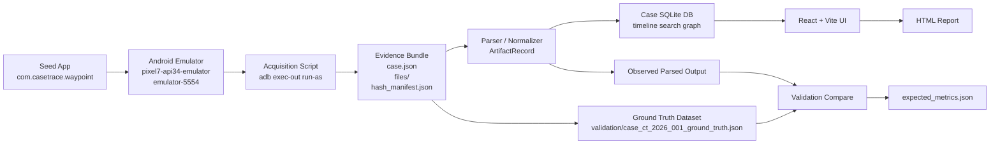

# CaseTrace Architecture

CaseTrace is intentionally split into acquisition, evidence handling, normalization, analysis storage, and presentation. Phase 0 locks the contract boundaries so later work can be validated against a single synthetic case model.

## Fixed Case Model

- Case ID: `CT-2026-001`
- Subject: `Jordan Vega`
- Seed app package: `com.casetrace.waypoint`
- Device: `pixel7-api34-emulator`
- ADB serial: `emulator-5554`
- Acquisition path: `/data/user/0/com.casetrace.waypoint/`
- Timezone: `America/New_York`
- Report format: `HTML`
- Ground-truth dataset: `case_ct_2026_001_ground_truth.json`
- Normalized record total: `42`
- Artifact taxonomy: `message`, `call`, `browser_visit`, `location_point`, `photo`, `app_event`, `recovered_record`

## Fixed Boundaries

- The seed app owns synthetic data generation only.
- The acquisition layer copies data from `/data/user/0/com.casetrace.waypoint/` without changing source files.
- The evidence bundle is the handoff point between acquisition and analysis.
- The parser normalizes all artifacts into `ArtifactRecord`.
- The case database supports unified timeline, search, and relationship analysis in later phases.
- The React UI is the only planned investigator interface for v1.
- The formal exported report remains `HTML` even though machine-readable JSON fixtures exist for validation.

## Evidence Bundle Contract

- `case.json` records case identity, subject, device, acquisition method, timezone, and report target.
- `files/` mirrors the acquired app-internal directory structure.
- `hash_manifest.json` provides SHA-256 coverage for every file in `files/`.
- `validation/case_ct_2026_001_ground_truth.json` defines the expected normalized outputs.
- `validation/expected_metrics.json` defines counts, deleted-record totals, and minimum correlation thresholds.
- The validation fixture is fixed at 42 records for the Phase 0 case model.

## Validation Path

Validation is a first-class branch in the architecture:

- acquisition artifacts are parsed into normalized records
- normalized records are compared to the ground-truth fixture
- observed counts and correlations are checked against `expected_metrics.json`
- every reported claim must be traceable to `raw_ref`
